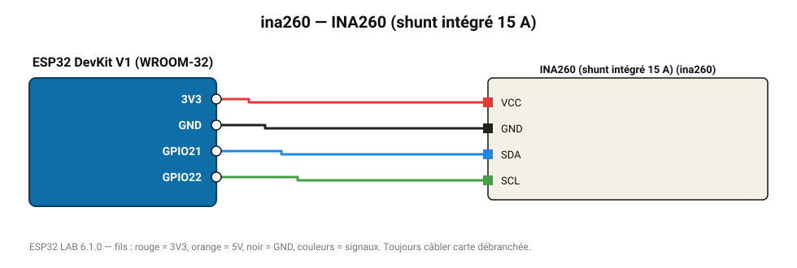

# INA260 (shunt intégré 15 A)

Wattmètre avec shunt de précision intégré : 36 V et ±15 A sans calcul d'étalonnage.

**Carte :** ESP32 DevKit V1 (WROOM-32) — moniteur série 115200 bauds.

| ESP32 | Composant | Broche | Couleur fil | Remarque |
|---|---|---|---|---|
| 3V3 | INA260 (shunt intégré 15 A) | VCC | rouge |  |
| GND | INA260 (shunt intégré 15 A) | GND | noir |  |
| GPIO21 | INA260 (shunt intégré 15 A) | SDA | bleu |  |
| GPIO22 | INA260 (shunt intégré 15 A) | SCL | vert |  |

Toujours câbler **carte débranchée**. Masse (GND) commune entre tous les modules.
