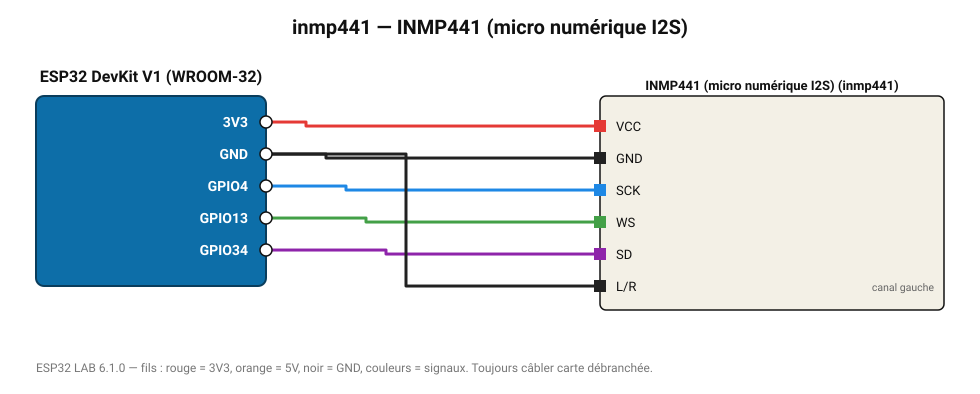

# INMP441 (micro numérique I2S)

Microphone MEMS numérique 24 bits : niveau sonore RMS, base pour reconnaissance audio.

**Carte :** ESP32 DevKit V1 (WROOM-32) — moniteur série 115200 bauds.

| ESP32 | Composant | Broche | Couleur fil | Remarque |
|---|---|---|---|---|
| 3V3 | INMP441 (micro numérique I2S) | VCC | rouge |  |
| GND | INMP441 (micro numérique I2S) | GND | noir |  |
| GPIO4 | INMP441 (micro numérique I2S) | SCK | bleu |  |
| GPIO13 | INMP441 (micro numérique I2S) | WS | vert |  |
| GPIO34 | INMP441 (micro numérique I2S) | SD | violet |  |
| GND | INMP441 (micro numérique I2S) | L/R | noir | canal gauche |

Toujours câbler **carte débranchée**. Masse (GND) commune entre tous les modules.
