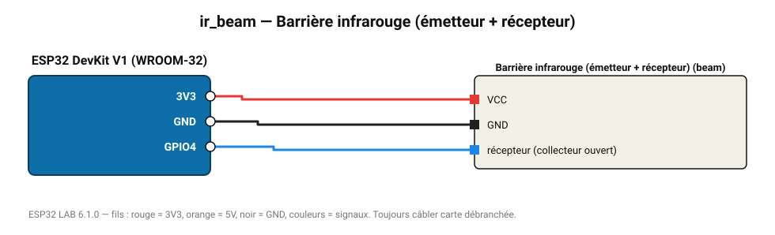

# Barrière infrarouge (émetteur + récepteur)

Faisceau IR coupé = passage détecté : compteur de passages, détection d'intrusion.

**Carte :** ESP32 DevKit V1 (WROOM-32) — moniteur série 115200 bauds.

| ESP32 | Composant | Broche | Couleur fil | Remarque |
|---|---|---|---|---|
| 3V3 | Barrière infrarouge (émetteur + récepteur) | VCC | rouge |  |
| GND | Barrière infrarouge (émetteur + récepteur) | GND | noir |  |
| GPIO4 | Barrière infrarouge (émetteur + récepteur) | récepteur (collecteur ouvert) | bleu |  |

Toujours câbler **carte débranchée**. Masse (GND) commune entre tous les modules.
