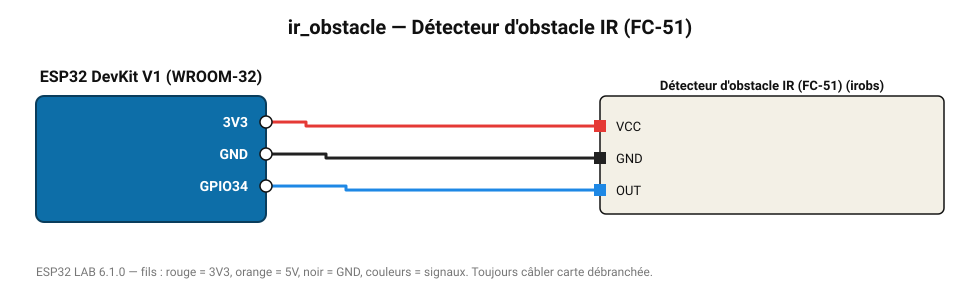

# Détecteur d'obstacle IR (FC-51)

Émetteur/récepteur IR réfléchi : détecte un obstacle de 2 à 30 cm (seuil réglable).

**Carte :** ESP32 DevKit V1 (WROOM-32) — moniteur série 115200 bauds.

| ESP32 | Composant | Broche | Couleur fil | Remarque |
|---|---|---|---|---|
| 3V3 | Détecteur d'obstacle IR (FC-51) | VCC | rouge |  |
| GND | Détecteur d'obstacle IR (FC-51) | GND | noir |  |
| GPIO34 | Détecteur d'obstacle IR (FC-51) | OUT | bleu |  |

Toujours câbler **carte débranchée**. Masse (GND) commune entre tous les modules.
