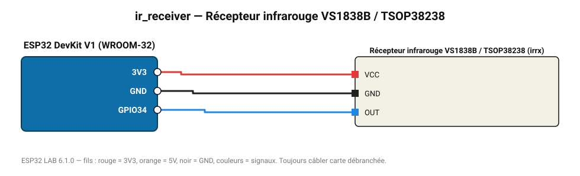

# Récepteur infrarouge VS1838B / TSOP38238

Décode les télécommandes TV (NEC, Sony, RC5, Samsung…) : protocole, adresse et commande.

**Carte :** ESP32 DevKit V1 (WROOM-32) — moniteur série 115200 bauds.

| ESP32 | Composant | Broche | Couleur fil | Remarque |
|---|---|---|---|---|
| 3V3 | Récepteur infrarouge VS1838B / TSOP38238 | VCC | rouge |  |
| GND | Récepteur infrarouge VS1838B / TSOP38238 | GND | noir |  |
| GPIO34 | Récepteur infrarouge VS1838B / TSOP38238 | OUT | bleu |  |

Toujours câbler **carte débranchée**. Masse (GND) commune entre tous les modules.
