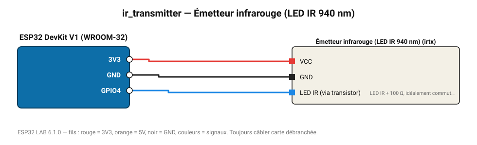

# Émetteur infrarouge (LED IR 940 nm)

Envoie des codes de télécommande NEC : pilotez une TV, une climatisation ou un ventilateur.

**Carte :** ESP32 DevKit V1 (WROOM-32) — moniteur série 115200 bauds.

| ESP32 | Composant | Broche | Couleur fil | Remarque |
|---|---|---|---|---|
| 3V3 | Émetteur infrarouge (LED IR 940 nm) | VCC | rouge |  |
| GND | Émetteur infrarouge (LED IR 940 nm) | GND | noir |  |
| GPIO4 | Émetteur infrarouge (LED IR 940 nm) | LED IR (via transistor) | bleu | LED IR + 100 Ω, idéalement commutée par un transistor NPN |

Toujours câbler **carte débranchée**. Masse (GND) commune entre tous les modules.
