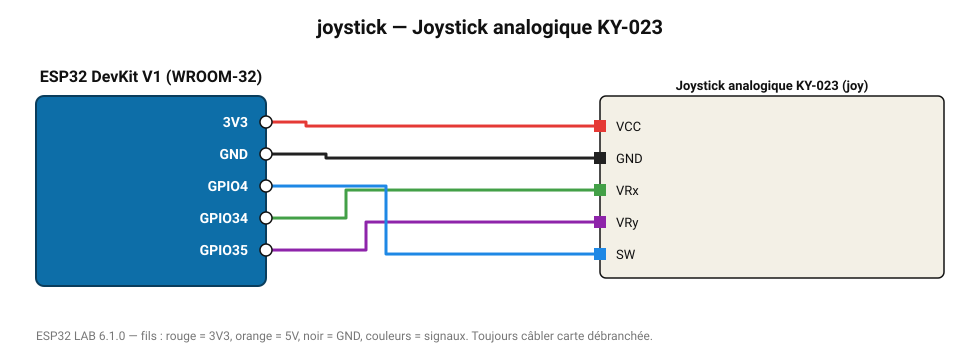

# Joystick analogique KY-023

Deux axes analogiques et un bouton poussoir (clic central).

**Carte :** ESP32 DevKit V1 (WROOM-32) — moniteur série 115200 bauds.

| ESP32 | Composant | Broche | Couleur fil | Remarque |
|---|---|---|---|---|
| 3V3 | Joystick analogique KY-023 | VCC | rouge |  |
| GND | Joystick analogique KY-023 | GND | noir |  |
| GPIO34 | Joystick analogique KY-023 | VRx | vert |  |
| GPIO35 | Joystick analogique KY-023 | VRy | violet |  |
| GPIO4 | Joystick analogique KY-023 | SW | bleu |  |

Toujours câbler **carte débranchée**. Masse (GND) commune entre tous les modules.
