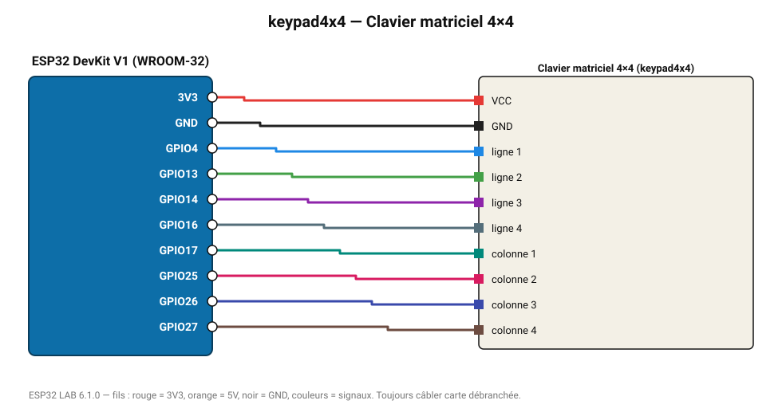

# Clavier matriciel 4×4

Clavier matriciel 4×4 : saisie de code PIN, menu, calculatrice.

**Carte :** ESP32 DevKit V1 (WROOM-32) — moniteur série 115200 bauds.

| ESP32 | Composant | Broche | Couleur fil | Remarque |
|---|---|---|---|---|
| 3V3 | Clavier matriciel 4×4 | VCC | rouge |  |
| GND | Clavier matriciel 4×4 | GND | noir |  |
| GPIO4 | Clavier matriciel 4×4 | ligne 1 | bleu |  |
| GPIO13 | Clavier matriciel 4×4 | ligne 2 | vert |  |
| GPIO14 | Clavier matriciel 4×4 | ligne 3 | violet |  |
| GPIO16 | Clavier matriciel 4×4 | ligne 4 | gris-bleu |  |
| GPIO17 | Clavier matriciel 4×4 | colonne 1 | turquoise |  |
| GPIO25 | Clavier matriciel 4×4 | colonne 2 | rose |  |
| GPIO26 | Clavier matriciel 4×4 | colonne 3 | indigo |  |
| GPIO27 | Clavier matriciel 4×4 | colonne 4 | marron |  |

Toujours câbler **carte débranchée**. Masse (GND) commune entre tous les modules.
