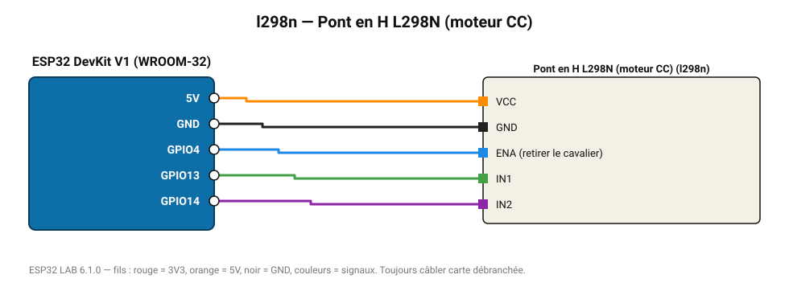

# Pont en H L298N (moteur CC)

Double pont en H 2 A : sens et vitesse de deux moteurs à courant continu.

**Carte :** ESP32 DevKit V1 (WROOM-32) — moniteur série 115200 bauds.

| ESP32 | Composant | Broche | Couleur fil | Remarque |
|---|---|---|---|---|
| 5V (VIN) | Pont en H L298N (moteur CC) | VCC | orange |  |
| GND | Pont en H L298N (moteur CC) | GND | noir |  |
| GPIO4 | Pont en H L298N (moteur CC) | ENA (retirer le cavalier) | bleu |  |
| GPIO13 | Pont en H L298N (moteur CC) | IN1 | vert |  |
| GPIO14 | Pont en H L298N (moteur CC) | IN2 | violet |  |

> ⚠ Consommation de pointe estimée 1580 mA : prévoyez une alimentation externe 5 V (le port USB d'un PC fournit ~500 mA).
> ⚠ Alimentez Pont en H L298N (moteur CC) directement en 5 V externe et reliez les masses (GND commun).

Toujours câbler **carte débranchée**. Masse (GND) commune entre tous les modules.
