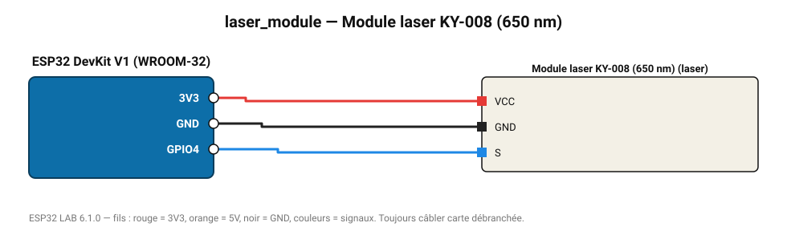

# Module laser KY-008 (650 nm)

Diode laser rouge 5 mW commandée par une broche (clignotement de démonstration).

**Carte :** ESP32 DevKit V1 (WROOM-32) — moniteur série 115200 bauds.

| ESP32 | Composant | Broche | Couleur fil | Remarque |
|---|---|---|---|---|
| 3V3 | Module laser KY-008 (650 nm) | VCC | rouge |  |
| GND | Module laser KY-008 (650 nm) | GND | noir |  |
| GPIO4 | Module laser KY-008 (650 nm) | S | bleu |  |

Toujours câbler **carte débranchée**. Masse (GND) commune entre tous les modules.
