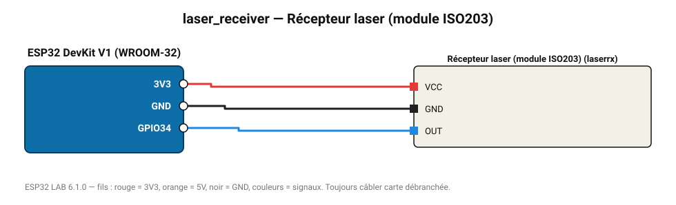

# Récepteur laser (module ISO203)

Détecte la présence du faisceau laser : barrière laser d'alarme.

**Carte :** ESP32 DevKit V1 (WROOM-32) — moniteur série 115200 bauds.

| ESP32 | Composant | Broche | Couleur fil | Remarque |
|---|---|---|---|---|
| 3V3 | Récepteur laser (module ISO203) | VCC | rouge |  |
| GND | Récepteur laser (module ISO203) | GND | noir |  |
| GPIO34 | Récepteur laser (module ISO203) | OUT | bleu |  |

Toujours câbler **carte débranchée**. Masse (GND) commune entre tous les modules.
