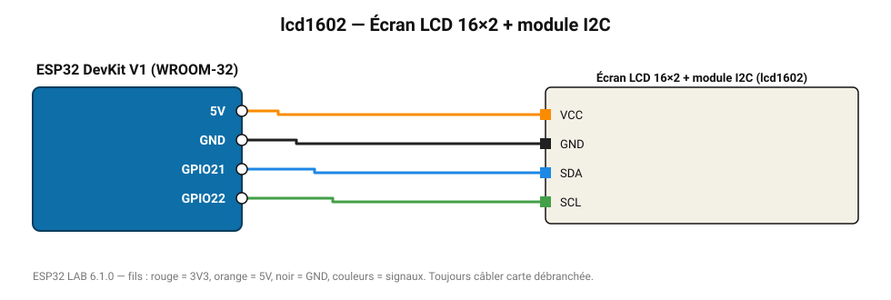

# Écran LCD 16×2 + module I2C

L'écran à cristaux liquides le plus répandu, piloté par 2 fils grâce au module PCF8574.

**Carte :** ESP32 DevKit V1 (WROOM-32) — moniteur série 115200 bauds.

| ESP32 | Composant | Broche | Couleur fil | Remarque |
|---|---|---|---|---|
| 5V (VIN) | Écran LCD 16×2 + module I2C | VCC | orange |  |
| GND | Écran LCD 16×2 + module I2C | GND | noir |  |
| GPIO21 | Écran LCD 16×2 + module I2C | SDA | bleu |  |
| GPIO22 | Écran LCD 16×2 + module I2C | SCL | vert |  |

Toujours câbler **carte débranchée**. Masse (GND) commune entre tous les modules.
