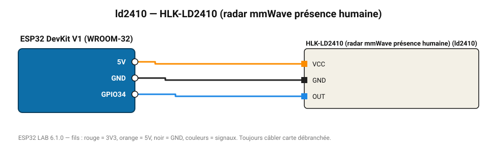

# HLK-LD2410 (radar mmWave présence humaine)

Radar 24 GHz qui détecte une personne immobile (respiration) jusqu'à 6 m.

**Carte :** ESP32 DevKit V1 (WROOM-32) — moniteur série 115200 bauds.

| ESP32 | Composant | Broche | Couleur fil | Remarque |
|---|---|---|---|---|
| 5V (VIN) | HLK-LD2410 (radar mmWave présence humaine) | VCC | orange |  |
| GND | HLK-LD2410 (radar mmWave présence humaine) | GND | noir |  |
| GPIO34 | HLK-LD2410 (radar mmWave présence humaine) | OUT | bleu |  |

Toujours câbler **carte débranchée**. Masse (GND) commune entre tous les modules.
