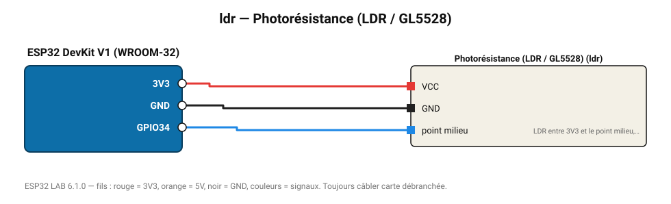

# Photorésistance (LDR / GL5528)

Cellule photoélectrique en pont diviseur avec une résistance de 10 kΩ : niveau de luminosité relatif.

**Carte :** ESP32 DevKit V1 (WROOM-32) — moniteur série 115200 bauds.

| ESP32 | Composant | Broche | Couleur fil | Remarque |
|---|---|---|---|---|
| 3V3 | Photorésistance (LDR / GL5528) | VCC | rouge |  |
| GND | Photorésistance (LDR / GL5528) | GND | noir |  |
| GPIO34 | Photorésistance (LDR / GL5528) | point milieu | bleu | LDR entre 3V3 et le point milieu, 10 kΩ entre le point milieu et GND |

Toujours câbler **carte débranchée**. Masse (GND) commune entre tous les modules.
