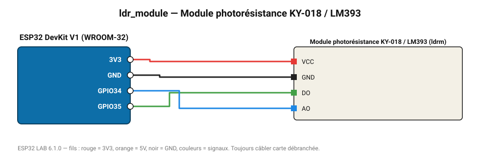

# Module photorésistance KY-018 / LM393

Module LDR avec comparateur réglable : sortie numérique jour/nuit et sortie analogique.

**Carte :** ESP32 DevKit V1 (WROOM-32) — moniteur série 115200 bauds.

| ESP32 | Composant | Broche | Couleur fil | Remarque |
|---|---|---|---|---|
| 3V3 | Module photorésistance KY-018 / LM393 | VCC | rouge |  |
| GND | Module photorésistance KY-018 / LM393 | GND | noir |  |
| GPIO35 | Module photorésistance KY-018 / LM393 | DO | vert |  |
| GPIO34 | Module photorésistance KY-018 / LM393 | AO | bleu |  |

Toujours câbler **carte débranchée**. Masse (GND) commune entre tous les modules.
