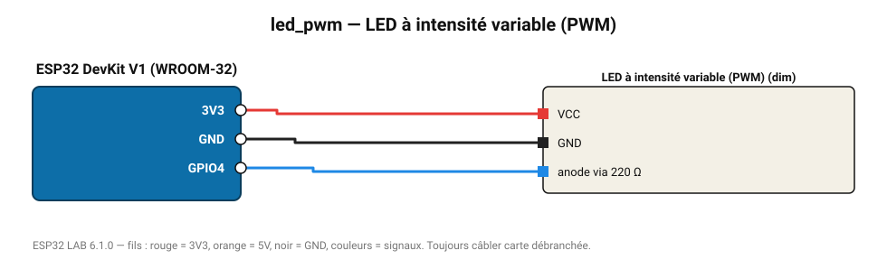

# LED à intensité variable (PWM)

Variation progressive de luminosité par modulation de largeur d'impulsion (LEDC 5 kHz, 10 bits).

**Carte :** ESP32 DevKit V1 (WROOM-32) — moniteur série 115200 bauds.

| ESP32 | Composant | Broche | Couleur fil | Remarque |
|---|---|---|---|---|
| 3V3 | LED à intensité variable (PWM) | VCC | rouge |  |
| GND | LED à intensité variable (PWM) | GND | noir |  |
| GPIO4 | LED à intensité variable (PWM) | anode via 220 Ω | bleu |  |

Toujours câbler **carte débranchée**. Masse (GND) commune entre tous les modules.
