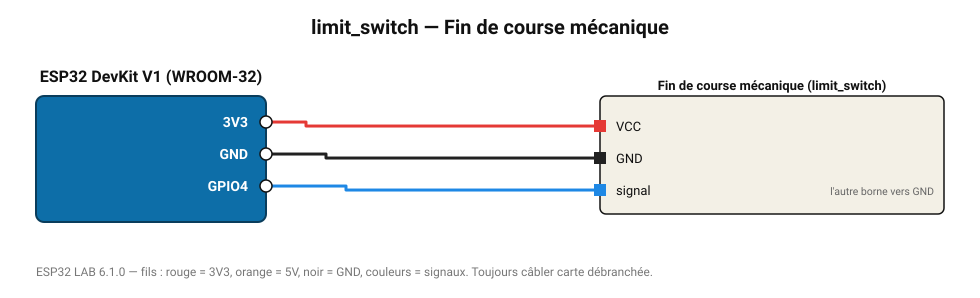

# Fin de course mécanique

Micro-rupteur à levier : butée d'axe, détection de porte, imprimante 3D.

**Carte :** ESP32 DevKit V1 (WROOM-32) — moniteur série 115200 bauds.

| ESP32 | Composant | Broche | Couleur fil | Remarque |
|---|---|---|---|---|
| 3V3 | Fin de course mécanique | VCC | rouge |  |
| GND | Fin de course mécanique | GND | noir |  |
| GPIO4 | Fin de course mécanique | signal | bleu | l'autre borne vers GND |

Toujours câbler **carte débranchée**. Masse (GND) commune entre tous les modules.
