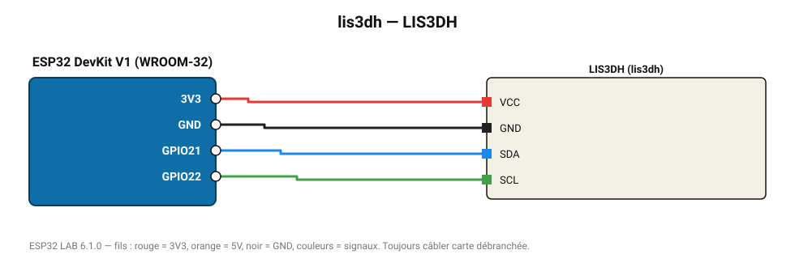

# LIS3DH

Accéléromètre ST ±2-16 g très basse consommation, avec détection de clic.

**Carte :** ESP32 DevKit V1 (WROOM-32) — moniteur série 115200 bauds.

| ESP32 | Composant | Broche | Couleur fil | Remarque |
|---|---|---|---|---|
| 3V3 | LIS3DH | VCC | rouge |  |
| GND | LIS3DH | GND | noir |  |
| GPIO21 | LIS3DH | SDA | bleu |  |
| GPIO22 | LIS3DH | SCL | vert |  |

Toujours câbler **carte débranchée**. Masse (GND) commune entre tous les modules.
