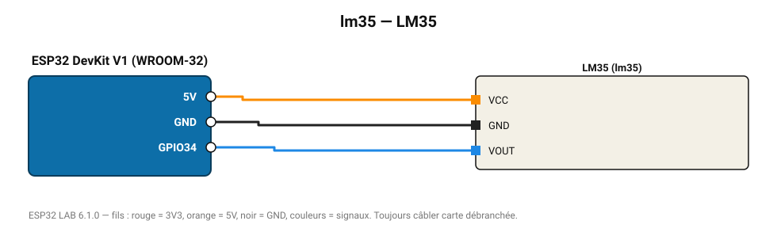

# LM35

Capteur analogique linéaire : 10 mV/°C, de 2 à 150 °C.

**Carte :** ESP32 DevKit V1 (WROOM-32) — moniteur série 115200 bauds.

| ESP32 | Composant | Broche | Couleur fil | Remarque |
|---|---|---|---|---|
| 5V (VIN) | LM35 | VCC | orange |  |
| GND | LM35 | GND | noir |  |
| GPIO34 | LM35 | VOUT | bleu |  |

Toujours câbler **carte débranchée**. Masse (GND) commune entre tous les modules.
