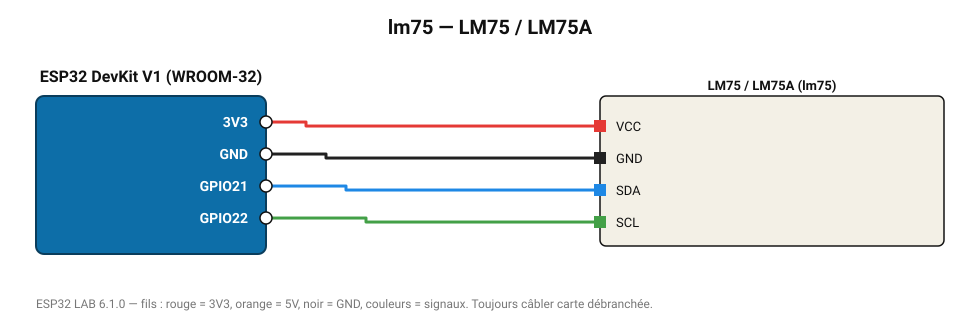

# LM75 / LM75A

Thermomètre et thermostat I2C classique (±2 °C), résolution 0,125 °C.

**Carte :** ESP32 DevKit V1 (WROOM-32) — moniteur série 115200 bauds.

| ESP32 | Composant | Broche | Couleur fil | Remarque |
|---|---|---|---|---|
| 3V3 | LM75 / LM75A | VCC | rouge |  |
| GND | LM75 / LM75A | GND | noir |  |
| GPIO21 | LM75 / LM75A | SDA | bleu |  |
| GPIO22 | LM75 / LM75A | SCL | vert |  |

Toujours câbler **carte débranchée**. Masse (GND) commune entre tous les modules.
