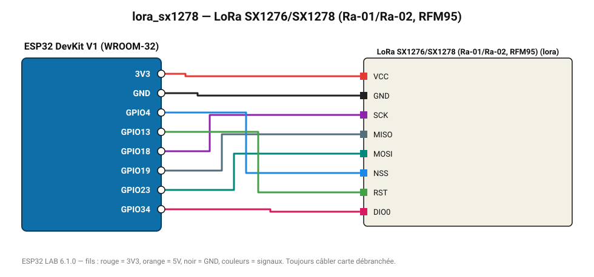

# LoRa SX1276/SX1278 (Ra-01/Ra-02, RFM95)

Radio longue portée (plusieurs km) : envoie un paquet périodique et affiche les paquets reçus avec le RSSI.

**Carte :** ESP32 DevKit V1 (WROOM-32) — moniteur série 115200 bauds.

| ESP32 | Composant | Broche | Couleur fil | Remarque |
|---|---|---|---|---|
| 3V3 | LoRa SX1276/SX1278 (Ra-01/Ra-02, RFM95) | VCC | rouge |  |
| GND | LoRa SX1276/SX1278 (Ra-01/Ra-02, RFM95) | GND | noir |  |
| GPIO18 | LoRa SX1276/SX1278 (Ra-01/Ra-02, RFM95) | SCK | violet |  |
| GPIO19 | LoRa SX1276/SX1278 (Ra-01/Ra-02, RFM95) | MISO | gris-bleu |  |
| GPIO23 | LoRa SX1276/SX1278 (Ra-01/Ra-02, RFM95) | MOSI | turquoise |  |
| GPIO4 | LoRa SX1276/SX1278 (Ra-01/Ra-02, RFM95) | NSS | bleu |  |
| GPIO13 | LoRa SX1276/SX1278 (Ra-01/Ra-02, RFM95) | RST | vert |  |
| GPIO34 | LoRa SX1276/SX1278 (Ra-01/Ra-02, RFM95) | DIO0 | rose |  |

Toujours câbler **carte débranchée**. Masse (GND) commune entre tous les modules.
