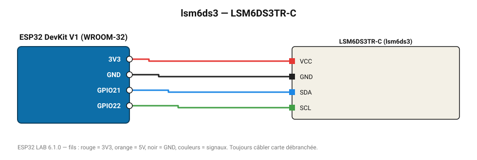

# LSM6DS3TR-C

IMU 6 axes ST : accéléromètre et gyroscope avec podomètre matériel.

**Carte :** ESP32 DevKit V1 (WROOM-32) — moniteur série 115200 bauds.

| ESP32 | Composant | Broche | Couleur fil | Remarque |
|---|---|---|---|---|
| 3V3 | LSM6DS3TR-C | VCC | rouge |  |
| GND | LSM6DS3TR-C | GND | noir |  |
| GPIO21 | LSM6DS3TR-C | SDA | bleu |  |
| GPIO22 | LSM6DS3TR-C | SCL | vert |  |

Toujours câbler **carte débranchée**. Masse (GND) commune entre tous les modules.
