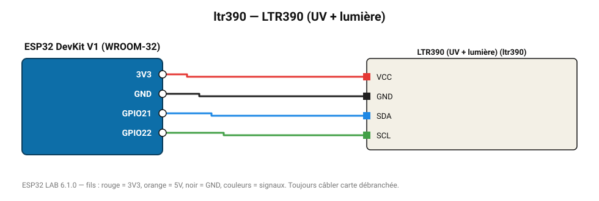

# LTR390 (UV + lumière)

Capteur Lite-On : indice UV et lumière ambiante.

**Carte :** ESP32 DevKit V1 (WROOM-32) — moniteur série 115200 bauds.

| ESP32 | Composant | Broche | Couleur fil | Remarque |
|---|---|---|---|---|
| 3V3 | LTR390 (UV + lumière) | VCC | rouge |  |
| GND | LTR390 (UV + lumière) | GND | noir |  |
| GPIO21 | LTR390 (UV + lumière) | SDA | bleu |  |
| GPIO22 | LTR390 (UV + lumière) | SCL | vert |  |

Toujours câbler **carte débranchée**. Masse (GND) commune entre tous les modules.
