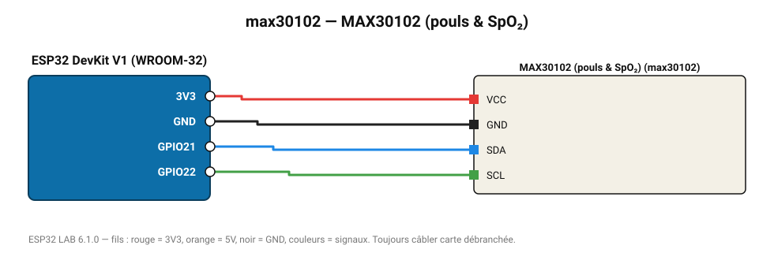

# MAX30102 (pouls & SpO₂)

Capteur optique rouge + infrarouge : fréquence cardiaque et présence du doigt.

**Carte :** ESP32 DevKit V1 (WROOM-32) — moniteur série 115200 bauds.

| ESP32 | Composant | Broche | Couleur fil | Remarque |
|---|---|---|---|---|
| 3V3 | MAX30102 (pouls & SpO₂) | VCC | rouge |  |
| GND | MAX30102 (pouls & SpO₂) | GND | noir |  |
| GPIO21 | MAX30102 (pouls & SpO₂) | SDA | bleu |  |
| GPIO22 | MAX30102 (pouls & SpO₂) | SCL | vert |  |

Toujours câbler **carte débranchée**. Masse (GND) commune entre tous les modules.
