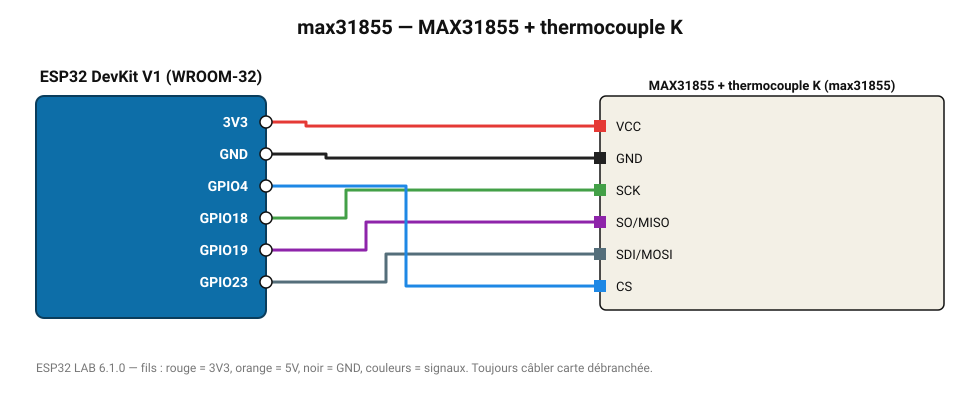

# MAX31855 + thermocouple K

Convertisseur thermocouple K moderne : -200 à 1350 °C, compensation de soudure froide.

**Carte :** ESP32 DevKit V1 (WROOM-32) — moniteur série 115200 bauds.

| ESP32 | Composant | Broche | Couleur fil | Remarque |
|---|---|---|---|---|
| 3V3 | MAX31855 + thermocouple K | VCC | rouge |  |
| GND | MAX31855 + thermocouple K | GND | noir |  |
| GPIO18 | MAX31855 + thermocouple K | SCK | vert |  |
| GPIO19 | MAX31855 + thermocouple K | SO/MISO | violet |  |
| GPIO23 | MAX31855 + thermocouple K | SDI/MOSI | gris-bleu |  |
| GPIO4 | MAX31855 + thermocouple K | CS | bleu |  |

Toujours câbler **carte débranchée**. Masse (GND) commune entre tous les modules.
