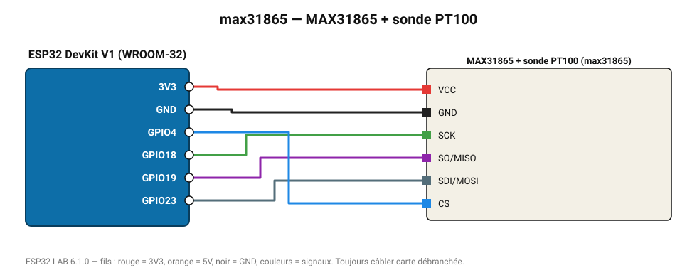

# MAX31865 + sonde PT100

Convertisseur pour sondes platine PT100/PT1000 (2, 3 ou 4 fils).

**Carte :** ESP32 DevKit V1 (WROOM-32) — moniteur série 115200 bauds.

| ESP32 | Composant | Broche | Couleur fil | Remarque |
|---|---|---|---|---|
| 3V3 | MAX31865 + sonde PT100 | VCC | rouge |  |
| GND | MAX31865 + sonde PT100 | GND | noir |  |
| GPIO18 | MAX31865 + sonde PT100 | SCK | vert |  |
| GPIO19 | MAX31865 + sonde PT100 | SO/MISO | violet |  |
| GPIO23 | MAX31865 + sonde PT100 | SDI/MOSI | gris-bleu |  |
| GPIO4 | MAX31865 + sonde PT100 | CS | bleu |  |

Toujours câbler **carte débranchée**. Masse (GND) commune entre tous les modules.
