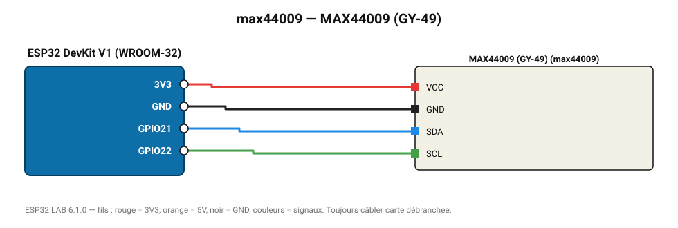

# MAX44009 (GY-49)

Luxmètre ultra-basse consommation 0,045-188 000 lx (lecture directe des registres).

**Carte :** ESP32 DevKit V1 (WROOM-32) — moniteur série 115200 bauds.

| ESP32 | Composant | Broche | Couleur fil | Remarque |
|---|---|---|---|---|
| 3V3 | MAX44009 (GY-49) | VCC | rouge |  |
| GND | MAX44009 (GY-49) | GND | noir |  |
| GPIO21 | MAX44009 (GY-49) | SDA | bleu |  |
| GPIO22 | MAX44009 (GY-49) | SCL | vert |  |

Toujours câbler **carte débranchée**. Masse (GND) commune entre tous les modules.
