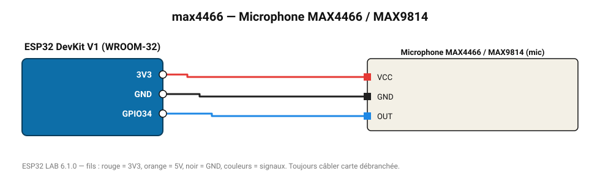

# Microphone MAX4466 / MAX9814

Micro électret amplifié : niveau sonore crête-à-crête et estimation en dB relatifs.

**Carte :** ESP32 DevKit V1 (WROOM-32) — moniteur série 115200 bauds.

| ESP32 | Composant | Broche | Couleur fil | Remarque |
|---|---|---|---|---|
| 3V3 | Microphone MAX4466 / MAX9814 | VCC | rouge |  |
| GND | Microphone MAX4466 / MAX9814 | GND | noir |  |
| GPIO34 | Microphone MAX4466 / MAX9814 | OUT | bleu |  |

Toujours câbler **carte débranchée**. Masse (GND) commune entre tous les modules.
