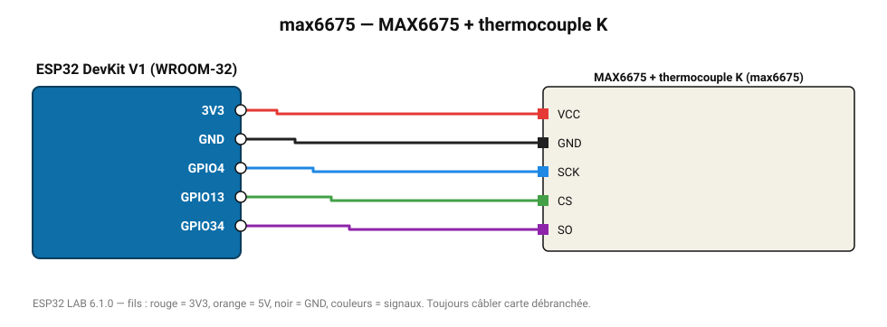

# MAX6675 + thermocouple K

Convertisseur thermocouple type K : 0 à 1024 °C, résolution 0,25 °C (lecture SPI logicielle).

**Carte :** ESP32 DevKit V1 (WROOM-32) — moniteur série 115200 bauds.

| ESP32 | Composant | Broche | Couleur fil | Remarque |
|---|---|---|---|---|
| 3V3 | MAX6675 + thermocouple K | VCC | rouge |  |
| GND | MAX6675 + thermocouple K | GND | noir |  |
| GPIO4 | MAX6675 + thermocouple K | SCK | bleu |  |
| GPIO13 | MAX6675 + thermocouple K | CS | vert |  |
| GPIO34 | MAX6675 + thermocouple K | SO | violet |  |

Toujours câbler **carte débranchée**. Masse (GND) commune entre tous les modules.
