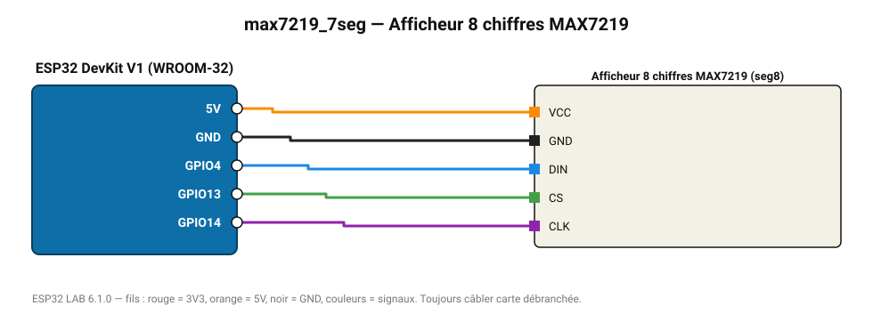

# Afficheur 8 chiffres MAX7219

Barrette 8 chiffres 7 segments : affiche la première mesure avec une décimale.

**Carte :** ESP32 DevKit V1 (WROOM-32) — moniteur série 115200 bauds.

| ESP32 | Composant | Broche | Couleur fil | Remarque |
|---|---|---|---|---|
| 5V (VIN) | Afficheur 8 chiffres MAX7219 | VCC | orange |  |
| GND | Afficheur 8 chiffres MAX7219 | GND | noir |  |
| GPIO4 | Afficheur 8 chiffres MAX7219 | DIN | bleu |  |
| GPIO13 | Afficheur 8 chiffres MAX7219 | CS | vert |  |
| GPIO14 | Afficheur 8 chiffres MAX7219 | CLK | violet |  |

Toujours câbler **carte débranchée**. Masse (GND) commune entre tous les modules.
