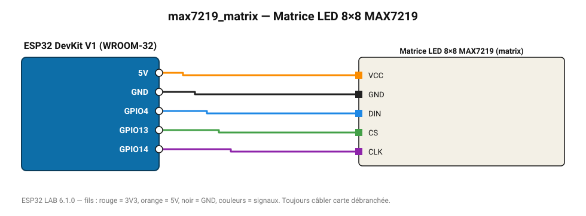

# Matrice LED 8×8 MAX7219

Matrice de 64 LED : barregraphe de la première mesure ou animation.

**Carte :** ESP32 DevKit V1 (WROOM-32) — moniteur série 115200 bauds.

| ESP32 | Composant | Broche | Couleur fil | Remarque |
|---|---|---|---|---|
| 5V (VIN) | Matrice LED 8×8 MAX7219 | VCC | orange |  |
| GND | Matrice LED 8×8 MAX7219 | GND | noir |  |
| GPIO4 | Matrice LED 8×8 MAX7219 | DIN | bleu |  |
| GPIO13 | Matrice LED 8×8 MAX7219 | CS | vert |  |
| GPIO14 | Matrice LED 8×8 MAX7219 | CLK | violet |  |

> ⚠ Alimentez Matrice LED 8×8 MAX7219 directement en 5 V externe et reliez les masses (GND commun).

Toujours câbler **carte débranchée**. Masse (GND) commune entre tous les modules.
