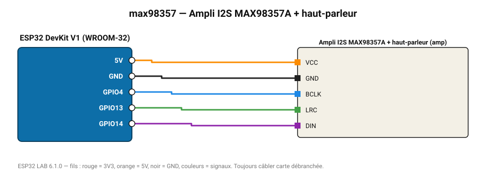

# Ampli I2S MAX98357A + haut-parleur

Amplificateur numérique 3 W classe D : génère un signal sinusoïdal par I2S (sirène, notes).

**Carte :** ESP32 DevKit V1 (WROOM-32) — moniteur série 115200 bauds.

| ESP32 | Composant | Broche | Couleur fil | Remarque |
|---|---|---|---|---|
| 5V (VIN) | Ampli I2S MAX98357A + haut-parleur | VCC | orange |  |
| GND | Ampli I2S MAX98357A + haut-parleur | GND | noir |  |
| GPIO4 | Ampli I2S MAX98357A + haut-parleur | BCLK | bleu |  |
| GPIO13 | Ampli I2S MAX98357A + haut-parleur | LRC | vert |  |
| GPIO14 | Ampli I2S MAX98357A + haut-parleur | DIN | violet |  |

> ⚠ Consommation de pointe estimée 730 mA : prévoyez une alimentation externe 5 V (le port USB d'un PC fournit ~500 mA).
> ⚠ Alimentez Ampli I2S MAX98357A + haut-parleur directement en 5 V externe et reliez les masses (GND commun).

Toujours câbler **carte débranchée**. Masse (GND) commune entre tous les modules.
