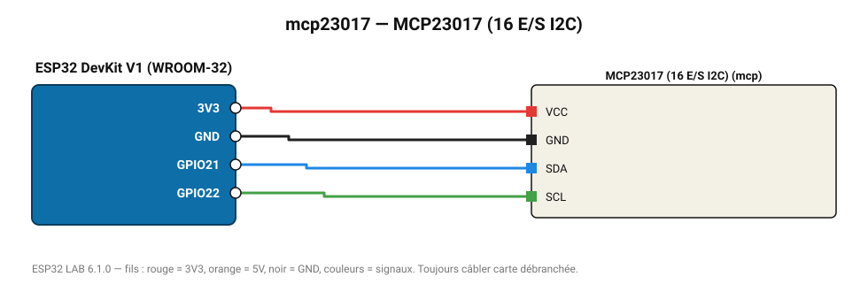

# MCP23017 (16 E/S I2C)

Ajoute 16 entrées/sorties numériques par I2C (jusqu'à 8 puces, 128 E/S).

**Carte :** ESP32 DevKit V1 (WROOM-32) — moniteur série 115200 bauds.

| ESP32 | Composant | Broche | Couleur fil | Remarque |
|---|---|---|---|---|
| 3V3 | MCP23017 (16 E/S I2C) | VCC | rouge |  |
| GND | MCP23017 (16 E/S I2C) | GND | noir |  |
| GPIO21 | MCP23017 (16 E/S I2C) | SDA | bleu |  |
| GPIO22 | MCP23017 (16 E/S I2C) | SCL | vert |  |

Toujours câbler **carte débranchée**. Masse (GND) commune entre tous les modules.
