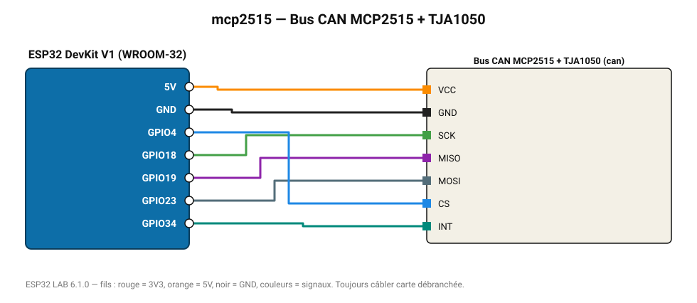

# Bus CAN MCP2515 + TJA1050

Contrôleur CAN 500 kbit/s : envoie une trame de test et affiche le trafic du bus.

**Carte :** ESP32 DevKit V1 (WROOM-32) — moniteur série 115200 bauds.

| ESP32 | Composant | Broche | Couleur fil | Remarque |
|---|---|---|---|---|
| 5V (VIN) | Bus CAN MCP2515 + TJA1050 | VCC | orange |  |
| GND | Bus CAN MCP2515 + TJA1050 | GND | noir |  |
| GPIO18 | Bus CAN MCP2515 + TJA1050 | SCK | vert |  |
| GPIO19 | Bus CAN MCP2515 + TJA1050 | MISO | violet |  |
| GPIO23 | Bus CAN MCP2515 + TJA1050 | MOSI | gris-bleu |  |
| GPIO4 | Bus CAN MCP2515 + TJA1050 | CS | bleu |  |
| GPIO34 | Bus CAN MCP2515 + TJA1050 | INT | turquoise |  |

Toujours câbler **carte débranchée**. Masse (GND) commune entre tous les modules.
