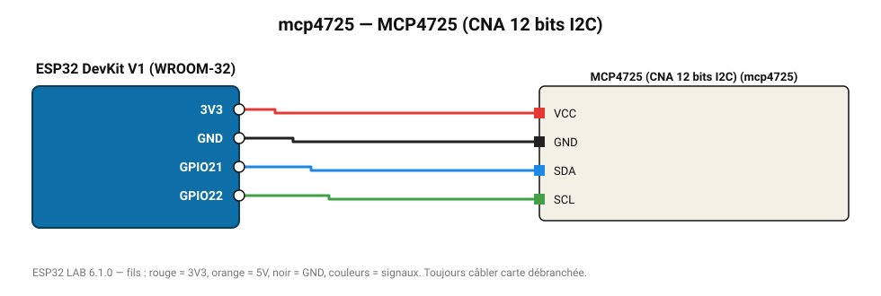

# MCP4725 (CNA 12 bits I2C)

Sortie de tension analogique 12 bits (0-VCC) avec mémoire EEPROM de la valeur au démarrage.

**Carte :** ESP32 DevKit V1 (WROOM-32) — moniteur série 115200 bauds.

| ESP32 | Composant | Broche | Couleur fil | Remarque |
|---|---|---|---|---|
| 3V3 | MCP4725 (CNA 12 bits I2C) | VCC | rouge |  |
| GND | MCP4725 (CNA 12 bits I2C) | GND | noir |  |
| GPIO21 | MCP4725 (CNA 12 bits I2C) | SDA | bleu |  |
| GPIO22 | MCP4725 (CNA 12 bits I2C) | SCL | vert |  |

Toujours câbler **carte débranchée**. Masse (GND) commune entre tous les modules.
