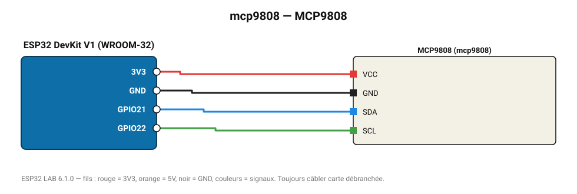

# MCP9808

Thermomètre numérique ±0,25 °C, 8 adresses possibles (A0-A2).

**Carte :** ESP32 DevKit V1 (WROOM-32) — moniteur série 115200 bauds.

| ESP32 | Composant | Broche | Couleur fil | Remarque |
|---|---|---|---|---|
| 3V3 | MCP9808 | VCC | rouge |  |
| GND | MCP9808 | GND | noir |  |
| GPIO21 | MCP9808 | SDA | bleu |  |
| GPIO22 | MCP9808 | SCL | vert |  |

Toujours câbler **carte débranchée**. Masse (GND) commune entre tous les modules.
