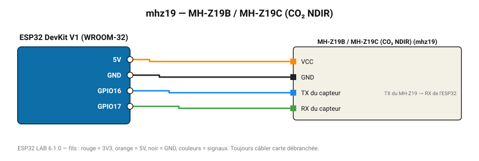

# MH-Z19B / MH-Z19C (CO₂ NDIR)

Capteur CO₂ infrarouge Winsen 0-5000 ppm, liaison série 9600 bauds.

**Carte :** ESP32 DevKit V1 (WROOM-32) — moniteur série 115200 bauds.

| ESP32 | Composant | Broche | Couleur fil | Remarque |
|---|---|---|---|---|
| 5V (VIN) | MH-Z19B / MH-Z19C (CO₂ NDIR) | VCC | orange |  |
| GND | MH-Z19B / MH-Z19C (CO₂ NDIR) | GND | noir |  |
| GPIO16 | MH-Z19B / MH-Z19C (CO₂ NDIR) | TX du capteur | bleu | TX du MH-Z19 → RX de l'ESP32 |
| GPIO17 | MH-Z19B / MH-Z19C (CO₂ NDIR) | RX du capteur | vert |  |

Toujours câbler **carte débranchée**. Masse (GND) commune entre tous les modules.
