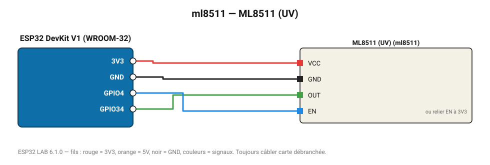

# ML8511 (UV)

Capteur UV-A/B Lapis : intensité en mW/cm² de 0 à 15.

**Carte :** ESP32 DevKit V1 (WROOM-32) — moniteur série 115200 bauds.

| ESP32 | Composant | Broche | Couleur fil | Remarque |
|---|---|---|---|---|
| 3V3 | ML8511 (UV) | VCC | rouge |  |
| GND | ML8511 (UV) | GND | noir |  |
| GPIO34 | ML8511 (UV) | OUT | vert |  |
| GPIO4 | ML8511 (UV) | EN | bleu | ou relier EN à 3V3 |

Toujours câbler **carte débranchée**. Masse (GND) commune entre tous les modules.
