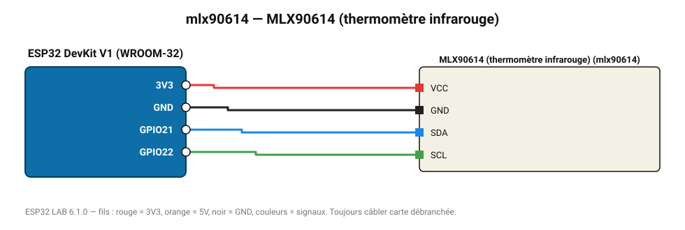

# MLX90614 (thermomètre infrarouge)

Mesure sans contact la température d'un objet (-70 à 380 °C) et la température ambiante.

**Carte :** ESP32 DevKit V1 (WROOM-32) — moniteur série 115200 bauds.

| ESP32 | Composant | Broche | Couleur fil | Remarque |
|---|---|---|---|---|
| 3V3 | MLX90614 (thermomètre infrarouge) | VCC | rouge |  |
| GND | MLX90614 (thermomètre infrarouge) | GND | noir |  |
| GPIO21 | MLX90614 (thermomètre infrarouge) | SDA | bleu |  |
| GPIO22 | MLX90614 (thermomètre infrarouge) | SCL | vert |  |

Toujours câbler **carte débranchée**. Masse (GND) commune entre tous les modules.
