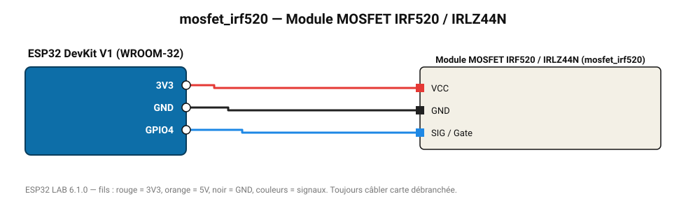

# Module MOSFET IRF520 / IRLZ44N

Commute une charge continue (ruban LED, moteur, électrovanne) jusqu'à 24 V en PWM.

**Carte :** ESP32 DevKit V1 (WROOM-32) — moniteur série 115200 bauds.

| ESP32 | Composant | Broche | Couleur fil | Remarque |
|---|---|---|---|---|
| 3V3 | Module MOSFET IRF520 / IRLZ44N | VCC | rouge |  |
| GND | Module MOSFET IRF520 / IRLZ44N | GND | noir |  |
| GPIO4 | Module MOSFET IRF520 / IRLZ44N | SIG / Gate | bleu |  |

Toujours câbler **carte débranchée**. Masse (GND) commune entre tous les modules.
