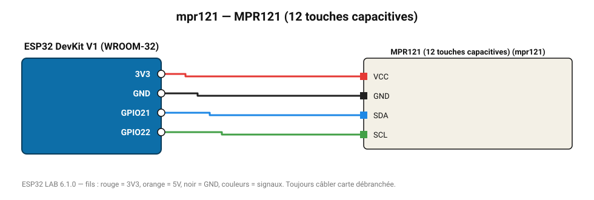

# MPR121 (12 touches capacitives)

12 électrodes tactiles : piano en fruits, panneau de commande, jeu interactif.

**Carte :** ESP32 DevKit V1 (WROOM-32) — moniteur série 115200 bauds.

| ESP32 | Composant | Broche | Couleur fil | Remarque |
|---|---|---|---|---|
| 3V3 | MPR121 (12 touches capacitives) | VCC | rouge |  |
| GND | MPR121 (12 touches capacitives) | GND | noir |  |
| GPIO21 | MPR121 (12 touches capacitives) | SDA | bleu |  |
| GPIO22 | MPR121 (12 touches capacitives) | SCL | vert |  |

Toujours câbler **carte débranchée**. Masse (GND) commune entre tous les modules.
