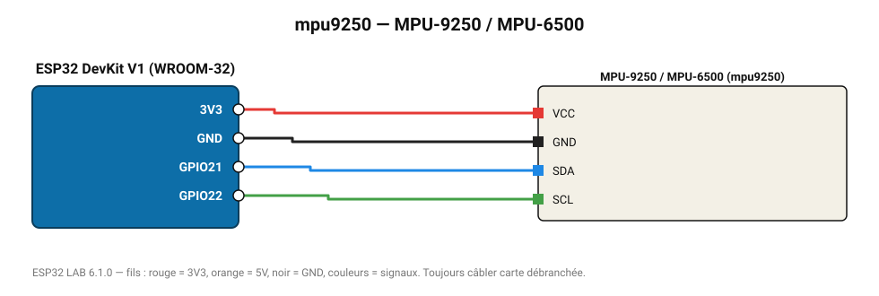

# MPU-9250 / MPU-6500

IMU InvenSense lue directement par registres (accéléromètre ±4 g, gyroscope ±500 °/s).

**Carte :** ESP32 DevKit V1 (WROOM-32) — moniteur série 115200 bauds.

| ESP32 | Composant | Broche | Couleur fil | Remarque |
|---|---|---|---|---|
| 3V3 | MPU-9250 / MPU-6500 | VCC | rouge |  |
| GND | MPU-9250 / MPU-6500 | GND | noir |  |
| GPIO21 | MPU-9250 / MPU-6500 | SDA | bleu |  |
| GPIO22 | MPU-9250 / MPU-6500 | SCL | vert |  |

Toujours câbler **carte débranchée**. Masse (GND) commune entre tous les modules.
