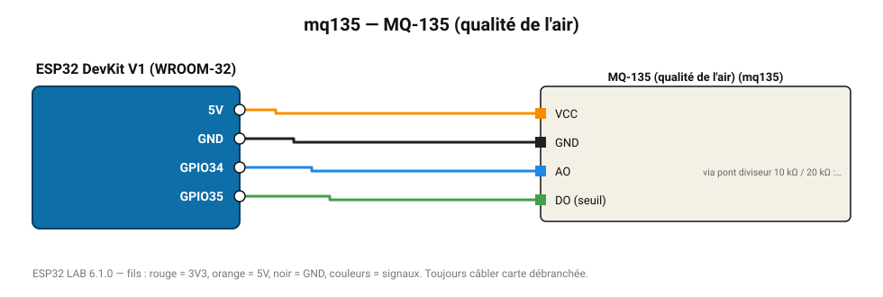

# MQ-135 (qualité de l'air)

Qualité de l'air : NH3, NOx, benzène, fumée, CO₂ (estimation relative).

**Carte :** ESP32 DevKit V1 (WROOM-32) — moniteur série 115200 bauds.

| ESP32 | Composant | Broche | Couleur fil | Remarque |
|---|---|---|---|---|
| 5V (VIN) | MQ-135 (qualité de l'air) | VCC | orange |  |
| GND | MQ-135 (qualité de l'air) | GND | noir |  |
| GPIO34 | MQ-135 (qualité de l'air) | AO | bleu | via pont diviseur 10 kΩ / 20 kΩ : la sortie monte à 5 V |
| GPIO35 | MQ-135 (qualité de l'air) | DO (seuil) | vert |  |

Toujours câbler **carte débranchée**. Masse (GND) commune entre tous les modules.
