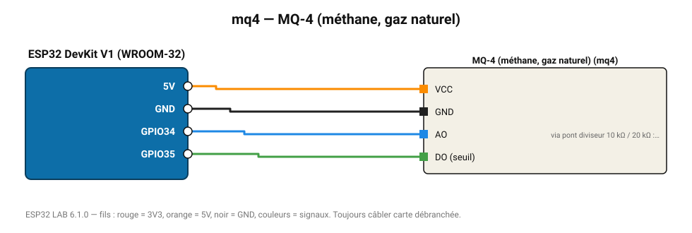

# MQ-4 (méthane, gaz naturel)

Sensible au méthane et au gaz naturel (200-10 000 ppm).

**Carte :** ESP32 DevKit V1 (WROOM-32) — moniteur série 115200 bauds.

| ESP32 | Composant | Broche | Couleur fil | Remarque |
|---|---|---|---|---|
| 5V (VIN) | MQ-4 (méthane, gaz naturel) | VCC | orange |  |
| GND | MQ-4 (méthane, gaz naturel) | GND | noir |  |
| GPIO34 | MQ-4 (méthane, gaz naturel) | AO | bleu | via pont diviseur 10 kΩ / 20 kΩ : la sortie monte à 5 V |
| GPIO35 | MQ-4 (méthane, gaz naturel) | DO (seuil) | vert |  |

Toujours câbler **carte débranchée**. Masse (GND) commune entre tous les modules.
