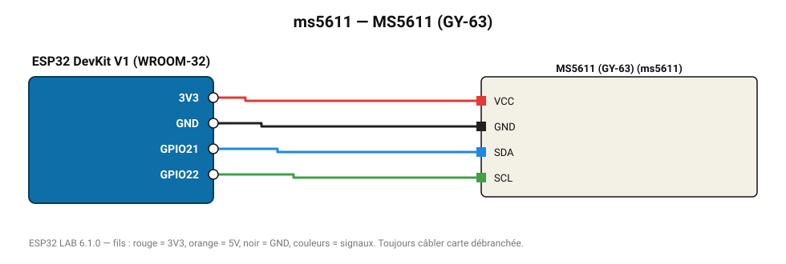

# MS5611 (GY-63)

Baromètre 24 bits pour variomètres et drones (résolution 10 cm).

**Carte :** ESP32 DevKit V1 (WROOM-32) — moniteur série 115200 bauds.

| ESP32 | Composant | Broche | Couleur fil | Remarque |
|---|---|---|---|---|
| 3V3 | MS5611 (GY-63) | VCC | rouge |  |
| GND | MS5611 (GY-63) | GND | noir |  |
| GPIO21 | MS5611 (GY-63) | SDA | bleu |  |
| GPIO22 | MS5611 (GY-63) | SCL | vert |  |

Toujours câbler **carte débranchée**. Masse (GND) commune entre tous les modules.
