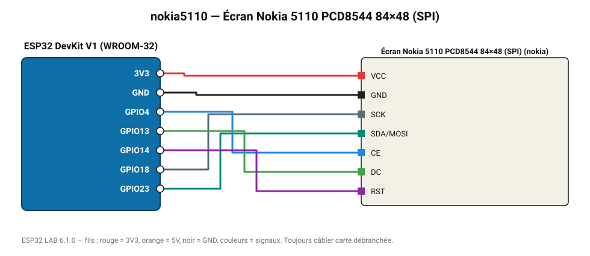

# Écran Nokia 5110 PCD8544 84×48 (SPI)

L'écran du téléphone Nokia 3310 : très basse consommation, rétroéclairage bleu.

**Carte :** ESP32 DevKit V1 (WROOM-32) — moniteur série 115200 bauds.

| ESP32 | Composant | Broche | Couleur fil | Remarque |
|---|---|---|---|---|
| 3V3 | Écran Nokia 5110 PCD8544 84×48 (SPI) | VCC | rouge |  |
| GND | Écran Nokia 5110 PCD8544 84×48 (SPI) | GND | noir |  |
| GPIO18 | Écran Nokia 5110 PCD8544 84×48 (SPI) | SCK | gris-bleu |  |
| GPIO23 | Écran Nokia 5110 PCD8544 84×48 (SPI) | SDA/MOSI | turquoise |  |
| GPIO4 | Écran Nokia 5110 PCD8544 84×48 (SPI) | CE | bleu |  |
| GPIO13 | Écran Nokia 5110 PCD8544 84×48 (SPI) | DC | vert |  |
| GPIO14 | Écran Nokia 5110 PCD8544 84×48 (SPI) | RST | violet |  |

Toujours câbler **carte débranchée**. Masse (GND) commune entre tous les modules.
