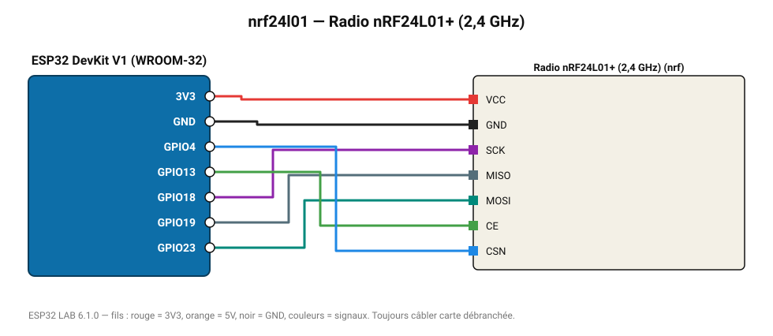

# Radio nRF24L01+ (2,4 GHz)

Liaison radio bas coût entre cartes (100 m, 1000 m en version PA+LNA) : envoie un compteur et écoute les réponses.

**Carte :** ESP32 DevKit V1 (WROOM-32) — moniteur série 115200 bauds.

| ESP32 | Composant | Broche | Couleur fil | Remarque |
|---|---|---|---|---|
| 3V3 | Radio nRF24L01+ (2,4 GHz) | VCC | rouge |  |
| GND | Radio nRF24L01+ (2,4 GHz) | GND | noir |  |
| GPIO18 | Radio nRF24L01+ (2,4 GHz) | SCK | violet |  |
| GPIO19 | Radio nRF24L01+ (2,4 GHz) | MISO | gris-bleu |  |
| GPIO23 | Radio nRF24L01+ (2,4 GHz) | MOSI | turquoise |  |
| GPIO13 | Radio nRF24L01+ (2,4 GHz) | CE | vert |  |
| GPIO4 | Radio nRF24L01+ (2,4 GHz) | CSN | bleu |  |

Toujours câbler **carte débranchée**. Masse (GND) commune entre tous les modules.
