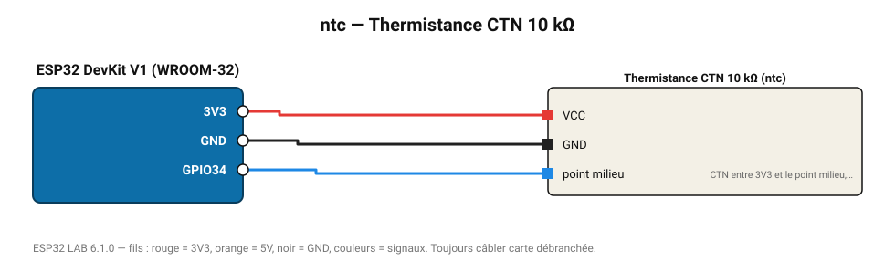

# Thermistance CTN 10 kΩ

Thermistance NTC 10 kΩ (B = 3950) en pont diviseur avec une résistance fixe de 10 kΩ.

**Carte :** ESP32 DevKit V1 (WROOM-32) — moniteur série 115200 bauds.

| ESP32 | Composant | Broche | Couleur fil | Remarque |
|---|---|---|---|---|
| 3V3 | Thermistance CTN 10 kΩ | VCC | rouge |  |
| GND | Thermistance CTN 10 kΩ | GND | noir |  |
| GPIO34 | Thermistance CTN 10 kΩ | point milieu | bleu | CTN entre 3V3 et le point milieu, 10 kΩ entre le point milieu et GND |

Toujours câbler **carte débranchée**. Masse (GND) commune entre tous les modules.
