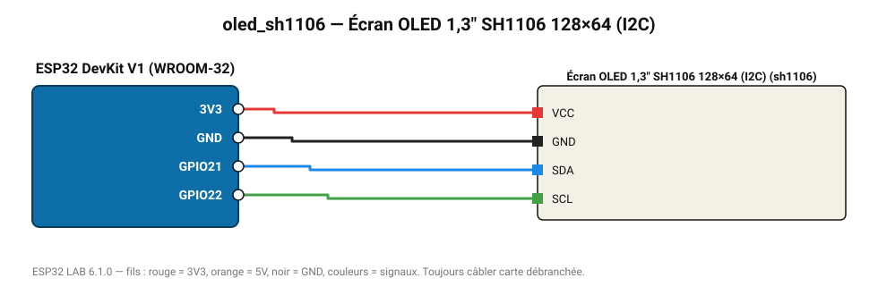

# Écran OLED 1,3" SH1106 128×64 (I2C)

Écran OLED 1,3 pouce (contrôleur SH1106, souvent confondu avec le SSD1306).

**Carte :** ESP32 DevKit V1 (WROOM-32) — moniteur série 115200 bauds.

| ESP32 | Composant | Broche | Couleur fil | Remarque |
|---|---|---|---|---|
| 3V3 | Écran OLED 1,3" SH1106 128×64 (I2C) | VCC | rouge |  |
| GND | Écran OLED 1,3" SH1106 128×64 (I2C) | GND | noir |  |
| GPIO21 | Écran OLED 1,3" SH1106 128×64 (I2C) | SDA | bleu |  |
| GPIO22 | Écran OLED 1,3" SH1106 128×64 (I2C) | SCL | vert |  |

Toujours câbler **carte débranchée**. Masse (GND) commune entre tous les modules.
