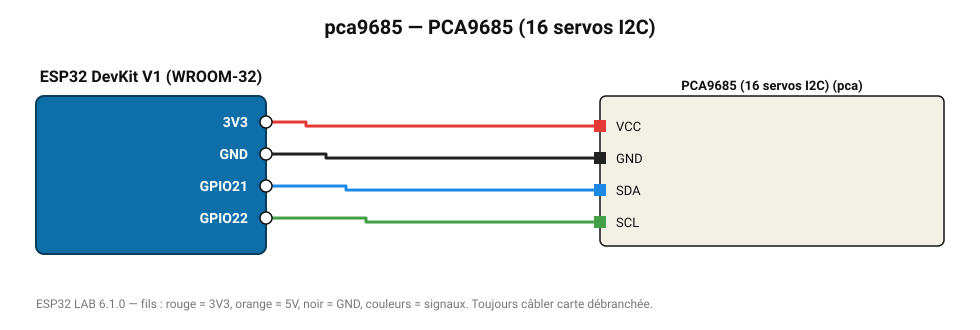

# PCA9685 (16 servos I2C)

Contrôleur 16 voies PWM 12 bits : bras robot, hexapode, jeux de lumière.

**Carte :** ESP32 DevKit V1 (WROOM-32) — moniteur série 115200 bauds.

| ESP32 | Composant | Broche | Couleur fil | Remarque |
|---|---|---|---|---|
| 3V3 | PCA9685 (16 servos I2C) | VCC | rouge |  |
| GND | PCA9685 (16 servos I2C) | GND | noir |  |
| GPIO21 | PCA9685 (16 servos I2C) | SDA | bleu |  |
| GPIO22 | PCA9685 (16 servos I2C) | SCL | vert |  |

Toujours câbler **carte débranchée**. Masse (GND) commune entre tous les modules.
